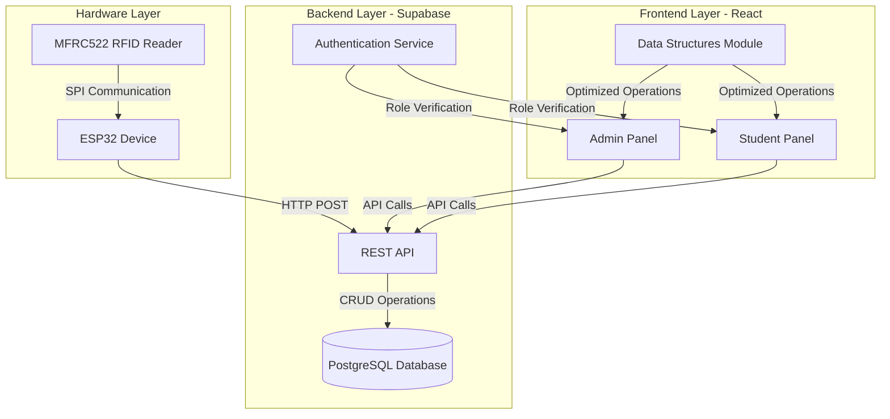
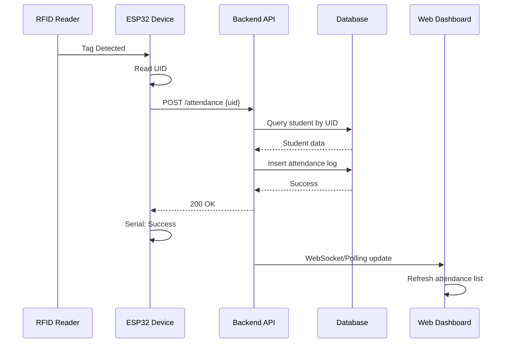
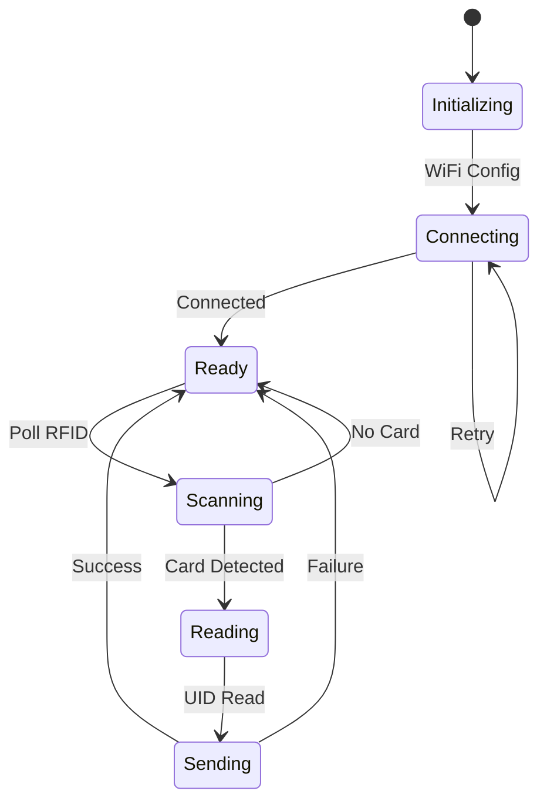

# Design Document

## Overview

The Smart Classroom Management System is a full-stack IoT solution consisting of three main layers:

1. **Hardware Layer**: ESP32 microcontroller with MFRC522 RFID reader
2. **Backend Layer**: Supabase (PostgreSQL) with REST API
3. **Frontend Layer**: React SPA with Tailwind CSS

The system enables automated attendance tracking, student registration, room allocation, and provides role-based access through Admin and Student panels.

## Architecture

### System Architecture Diagram



### Communication Flow



## Components and Interfaces

### 1. Hardware Component (ESP32 + RFID)

#### Pin Configuration
- **SDA (SS)**: GPIO 21
- **SCK**: GPIO 18
- **MOSI**: GPIO 23
- **MISO**: GPIO 19
- **RST**: GPIO 22

#### Core Functions

```cpp
// WiFi Connection
void connectWiFi(const char* ssid, const char* password);

// RFID Operations
void initRFID();
bool pollRFIDCard();
String readCardUID();

// HTTP Communication
bool sendAttendance(String uid);
void handleHTTPResponse(int statusCode);
```

#### State Machine



### 2. Backend Component (Supabase)

#### Database Schema

**students table**
```sql
CREATE TABLE students (
    id UUID PRIMARY KEY DEFAULT uuid_generate_v4(),
    name TEXT NOT NULL,
    uid TEXT UNIQUE NOT NULL,
    email TEXT NOT NULL,
    phone TEXT,
    dob DATE,
    course TEXT NOT NULL,
    created_at TIMESTAMPTZ DEFAULT NOW()
);

CREATE INDEX idx_students_uid ON students(uid);
```

**attendance_logs table**
```sql
CREATE TABLE attendance_logs (
    id SERIAL PRIMARY KEY,
    student_uid TEXT NOT NULL REFERENCES students(uid),
    timestamp TIMESTAMPTZ DEFAULT NOW(),
    status TEXT DEFAULT 'present',
    CONSTRAINT fk_student FOREIGN KEY (student_uid) 
        REFERENCES students(uid) ON DELETE CASCADE
);

CREATE INDEX idx_attendance_uid ON attendance_logs(student_uid);
CREATE INDEX idx_attendance_timestamp ON attendance_logs(timestamp);
```

**rooms table**
```sql
CREATE TABLE rooms (
    id SERIAL PRIMARY KEY,
    room_no TEXT UNIQUE NOT NULL,
    is_busy BOOLEAN DEFAULT FALSE,
    current_class TEXT,
    professor_name TEXT,
    updated_at TIMESTAMPTZ DEFAULT NOW()
);

CREATE INDEX idx_rooms_busy ON rooms(is_busy);
```

**timetable table**
```sql
CREATE TABLE timetable (
    id SERIAL PRIMARY KEY,
    course TEXT NOT NULL,
    day_of_week INTEGER NOT NULL, -- 0=Sunday, 6=Saturday
    start_time TIME NOT NULL,
    end_time TIME NOT NULL,
    subject TEXT NOT NULL,
    room_no TEXT REFERENCES rooms(room_no),
    professor_name TEXT NOT NULL
);

CREATE INDEX idx_timetable_course ON timetable(course);
```

**users table (Authentication)**
```sql
CREATE TABLE users (
    id UUID PRIMARY KEY DEFAULT uuid_generate_v4(),
    email TEXT UNIQUE NOT NULL,
    role TEXT NOT NULL CHECK (role IN ('admin', 'student')),
    student_uid TEXT REFERENCES students(uid),
    created_at TIMESTAMPTZ DEFAULT NOW()
);
```

#### API Endpoints

**Attendance Endpoints**
- `POST /api/attendance` - Log attendance from ESP32
- `GET /api/attendance` - Get all attendance logs (Admin)
- `GET /api/attendance/:uid` - Get student-specific logs (Student)

**Student Endpoints**
- `POST /api/students` - Register new student (Admin)
- `GET /api/students` - List all students (Admin)
- `GET /api/students/:uid` - Get student details
- `PUT /api/students/:uid` - Update student (Admin)
- `DELETE /api/students/:uid` - Delete student (Admin)
- `GET /api/students/latest-scan` - Get most recent scanned UID

**Room Endpoints**
- `GET /api/rooms` - List all rooms
- `GET /api/rooms/available` - Get available rooms (is_busy = false)
- `POST /api/rooms/allocate` - Allocate room (Admin)
- `PUT /api/rooms/:id/release` - Release room (Admin)

**Timetable Endpoints**
- `GET /api/timetable/:course` - Get timetable for course
- `POST /api/timetable` - Create timetable entry (Admin)
- `GET /api/timetable/current/:course` - Get current lecture info

### 3. Data Structures Module

#### Queue Implementation (RFID Scan Queue)

```javascript
class Queue {
    constructor() {
        this.items = [];
    }
    
    enqueue(element) {
        this.items.push(element);
    }
    
    dequeue() {
        if (this.isEmpty()) return null;
        return this.items.shift();
    }
    
    isEmpty() {
        return this.items.length === 0;
    }
    
    peek() {
        return this.isEmpty() ? null : this.items[0];
    }
}
```

**Use Case**: Buffer RFID scans when multiple cards are detected rapidly, ensuring FIFO processing.

#### Stack Implementation (Navigation History)

```javascript
class Stack {
    constructor() {
        this.items = [];
    }
    
    push(element) {
        this.items.push(element);
    }
    
    pop() {
        if (this.isEmpty()) return null;
        return this.items.pop();
    }
    
    isEmpty() {
        return this.items.length === 0;
    }
    
    peek() {
        return this.isEmpty() ? null : this.items[this.items.length - 1];
    }
}
```

**Use Case**: Track navigation history for back button functionality in the dashboard.

#### Linked List Implementation (Attendance Records)

```javascript
class Node {
    constructor(data) {
        this.data = data;
        this.next = null;
    }
}

class LinkedList {
    constructor() {
        this.head = null;
        this.size = 0;
    }
    
    insert(data) {
        const newNode = new Node(data);
        if (!this.head) {
            this.head = newNode;
        } else {
            let current = this.head;
            while (current.next) {
                current = current.next;
            }
            current.next = newNode;
        }
        this.size++;
    }
    
    delete(data) {
        if (!this.head) return false;
        
        if (this.head.data === data) {
            this.head = this.head.next;
            this.size--;
            return true;
        }
        
        let current = this.head;
        while (current.next) {
            if (current.next.data === data) {
                current.next = current.next.next;
                this.size--;
                return true;
            }
            current = current.next;
        }
        return false;
    }
    
    toArray() {
        const result = [];
        let current = this.head;
        while (current) {
            result.push(current.data);
            current = current.next;
        }
        return result;
    }
}
```

**Use Case**: Efficiently manage attendance records with frequent insertions and deletions.

#### Hash Map Implementation (Student Lookup)

```javascript
class HashMap {
    constructor(size = 100) {
        this.buckets = new Array(size);
        this.size = size;
    }
    
    hash(key) {
        let hash = 0;
        for (let i = 0; i < key.length; i++) {
            hash = (hash + key.charCodeAt(i) * i) % this.size;
        }
        return hash;
    }
    
    set(key, value) {
        const index = this.hash(key);
        if (!this.buckets[index]) {
            this.buckets[index] = [];
        }
        
        const bucket = this.buckets[index];
        for (let i = 0; i < bucket.length; i++) {
            if (bucket[i][0] === key) {
                bucket[i][1] = value;
                return;
            }
        }
        bucket.push([key, value]);
    }
    
    get(key) {
        const index = this.hash(key);
        const bucket = this.buckets[index];
        
        if (!bucket) return null;
        
        for (let i = 0; i < bucket.length; i++) {
            if (bucket[i][0] === key) {
                return bucket[i][1];
            }
        }
        return null;
    }
}
```

**Use Case**: Fast O(1) lookup of student records by UID for attendance processing.

### 4. Frontend Component (React Dashboard)

#### Component Hierarchy

```
App
├── AuthProvider
│   ├── Login
│   └── RoleBasedRouter
│       ├── AdminPanel
│       │   ├── Navigation
│       │   ├── RegistrationPage
│       │   │   ├── StudentForm
│       │   │   └── ScanButton
│       │   ├── AttendancePage
│       │   │   ├── AttendanceTable
│       │   │   └── ProgressBar
│       │   ├── RoomAllocationPage
│       │   │   ├── AllocationForm
│       │   │   └── RoomRecommendations
│       │   └── TimetableManagement
│       └── StudentPanel
│           ├── Navigation
│           ├── AttendanceView
│           │   └── ProgressBar
│           ├── TimetableView
│           └── CurrentLectureCard
└── DataStructuresContext
```

#### Key Components Design

**RegistrationPage Component**
```jsx
// State management
- formData: {name, email, phone, dob, course, uid}
- isScanning: boolean
- scanQueue: Queue instance

// Functions
- handleScan(): Fetch latest UID from API
- handleSubmit(): POST student data
- validateForm(): Check required fields
```

**AttendancePage Component**
```jsx
// State management
- attendanceLogs: LinkedList instance
- studentMap: HashMap instance
- filterOptions: {date, course, student}

// Functions
- fetchAttendance(): GET logs from API
- calculatePercentage(uid): (count / 50) * 100
- refreshLogs(): Poll for updates every 5s
```

**RoomAllocationPage Component**
```jsx
// State management
- rooms: Array
- selectedRoom: Object
- allocationForm: {room_no, subject, professor}

// Functions
- checkRoomAvailability(room_no): Query is_busy
- getRecommendations(): Filter rooms where is_busy = false
- allocateRoom(): POST allocation, UPDATE room status
```

**StudentPanel Component**
```jsx
// State management
- studentData: Object
- attendancePercentage: Number
- timetable: Array
- currentLecture: Object

// Functions
- fetchStudentData(): GET student info by UID
- fetchTimetable(): GET timetable by course
- getCurrentLecture(): Query current class based on time
```

## Data Models

### Student Model
```typescript
interface Student {
    id: string;
    name: string;
    uid: string;
    email: string;
    phone: string;
    dob: Date;
    course: string;
    createdAt: Date;
}
```

### Attendance Log Model
```typescript
interface AttendanceLog {
    id: number;
    studentUid: string;
    timestamp: Date;
    status: 'present' | 'absent';
    studentName?: string; // Joined from students table
}
```

### Room Model
```typescript
interface Room {
    id: number;
    roomNo: string;
    isBusy: boolean;
    currentClass: string | null;
    professorName: string | null;
    updatedAt: Date;
}
```

### Timetable Model
```typescript
interface TimetableEntry {
    id: number;
    course: string;
    dayOfWeek: number;
    startTime: string;
    endTime: string;
    subject: string;
    roomNo: string;
    professorName: string;
}
```

### User Model
```typescript
interface User {
    id: string;
    email: string;
    role: 'admin' | 'student';
    studentUid?: string;
}
```

## Error Handling

### ESP32 Error Handling

```cpp
// WiFi Connection Errors
- Retry mechanism: 3 attempts with 5s delay
- Fallback: Enter AP mode for configuration
- Serial logging: Connection status

// RFID Read Errors
- Timeout: 2s per read attempt
- Invalid UID: Log and skip
- Communication failure: Reset RFID module

// HTTP Errors
- Network timeout: 10s
- 4xx errors: Log UID for manual entry
- 5xx errors: Queue for retry (max 5 items)
```

### Backend Error Handling

```javascript
// Database Errors
- Unique constraint violation: Return 409 Conflict
- Foreign key violation: Return 400 Bad Request
- Connection timeout: Return 503 Service Unavailable

// Validation Errors
- Missing required fields: Return 400 with field list
- Invalid data format: Return 422 Unprocessable Entity
- Authentication failure: Return 401 Unauthorized
- Authorization failure: Return 403 Forbidden
```

### Frontend Error Handling

```javascript
// API Call Errors
- Network error: Show retry button
- 401/403: Redirect to login
- 4xx: Display user-friendly message
- 5xx: Show "Service unavailable" message

// Form Validation
- Client-side validation before submission
- Display inline error messages
- Prevent submission until valid

// State Management Errors
- Fallback to empty state
- Log errors to console
- Display error boundary component
```

## Testing Strategy

### Hardware Testing

**Unit Tests**
- WiFi connection function
- RFID read function
- HTTP POST function
- Pin configuration validation

**Integration Tests**
- End-to-end: Card scan → API call → Response
- Network failure scenarios
- Multiple rapid scans

**Manual Tests**
- Physical card scanning
- Serial monitor output verification
- WiFi reconnection after dropout

### Backend Testing

**Unit Tests**
- Database CRUD operations
- Data validation functions
- Authentication/authorization logic
- Data structure implementations

**Integration Tests**
- API endpoint responses
- Database transactions
- Role-based access control
- Concurrent request handling

**Load Tests**
- 100 concurrent attendance logs
- 1000 student records query
- Room allocation race conditions

### Frontend Testing

**Unit Tests**
- Component rendering
- Form validation logic
- Data structure operations
- Utility functions

**Integration Tests**
- API integration
- Authentication flow
- Navigation between pages
- Real-time updates

**E2E Tests**
- Complete registration flow
- Attendance logging and display
- Room allocation workflow
- Student panel access

**Manual Tests**
- UI/UX validation
- Responsive design
- Cross-browser compatibility
- Accessibility compliance

## Security Considerations

### Authentication & Authorization
- JWT-based authentication via Supabase Auth
- Role-based access control (Admin vs Student)
- Secure password hashing
- Session management with token refresh

### Data Protection
- HTTPS for all API communications
- Environment variables for sensitive config
- SQL injection prevention via parameterized queries
- XSS protection via React's built-in escaping

### ESP32 Security
- WiFi credentials stored in secure flash
- HTTPS for API calls (if supported)
- Rate limiting on backend to prevent spam
- Device authentication token

## Performance Optimization

### Backend
- Database indexing on frequently queried fields (uid, timestamp)
- Connection pooling for database
- Caching for timetable and room data
- Pagination for large result sets

### Frontend
- Lazy loading of components
- Memoization of expensive calculations
- Debouncing of search inputs
- Virtual scrolling for large lists
- Data structure optimizations (HashMap for O(1) lookups)

### Hardware
- Efficient polling interval (500ms)
- Minimal serial output
- Power-saving modes when idle
- Watchdog timer for crash recovery

## Deployment Strategy

### ESP32
- Arduino IDE or PlatformIO
- OTA (Over-The-Air) updates capability
- Configuration via Serial or web interface
- Multiple device support with unique IDs

### Backend
- Supabase cloud hosting
- Database migrations via Supabase CLI
- Environment-based configuration
- Automated backups

### Frontend
- Build: `npm run build`
- Hosting: Vercel, Netlify, or Supabase hosting
- Environment variables for API endpoints
- CI/CD pipeline for automated deployment

## Future Enhancements

1. **Mobile App**: React Native app for students
2. **Biometric Integration**: Fingerprint as backup to RFID
3. **Analytics Dashboard**: Attendance trends and insights
4. **Notification System**: Email/SMS alerts for low attendance
5. **Multi-campus Support**: Scale to multiple locations
6. **Offline Mode**: Local storage with sync when online
7. **Advanced Data Structures**: Binary Search Trees for sorted data, Graphs for room relationships
