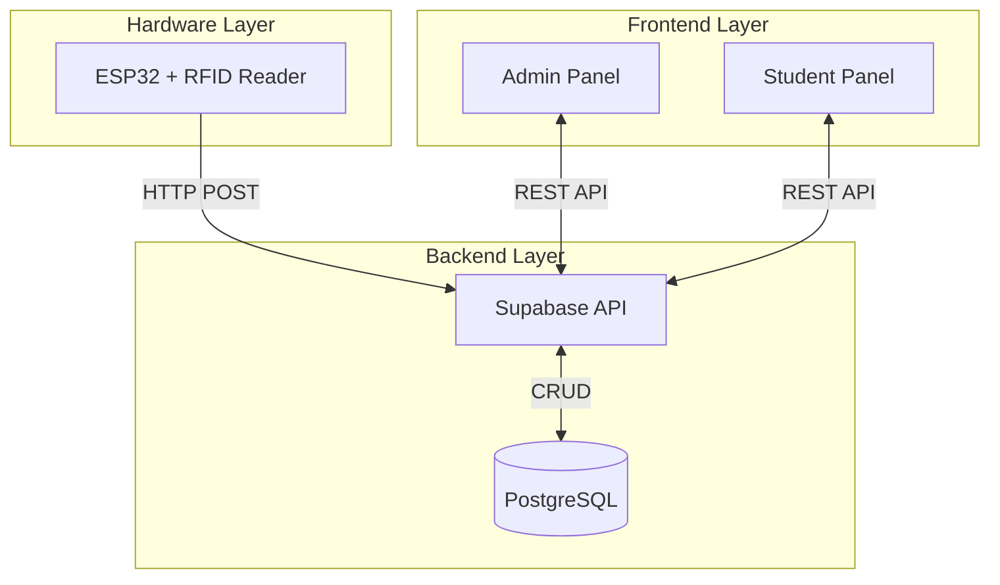

# Smart Classroom Management System

An IoT-based classroom management solution integrating ESP32 hardware with RFID technology, cloud backend (Supabase), and a React web dashboard for automated attendance tracking, student registration, and intelligent room allocation.

## Overview

The Smart Classroom Management System consists of four main components:

1. **ESP32 Hardware**: RFID reader for automated attendance scanning
2. **Backend API**: Supabase (PostgreSQL) for data storage and REST API
3. **Frontend Dashboard**: React SPA with Admin and Student panels
4. **Data Structures**: Custom implementations for optimized operations

## Features

### 🎓 Automated Attendance Tracking
- RFID-based student identification
- Real-time attendance logging
- Automatic percentage calculation
- Visual progress indicators

### 👥 Student Management
- Easy registration with RFID mapping
- Student profile management
- Course-based organization
- Bulk operations support

### 🏫 Room Allocation
- Real-time room availability
- Conflict detection
- Alternative room recommendations
- Professor and subject tracking

### 📅 Timetable Management
- Course-based schedules
- Weekly view with current lecture highlighting
- Room and professor information
- Student and admin access

### 🔐 Role-Based Access Control
- Admin panel with full management capabilities
- Student panel with personal data access
- Secure authentication via Supabase Auth
- Protected routes and API endpoints

### 📊 Custom Data Structures
- Queue for RFID scan buffering
- Stack for navigation history
- LinkedList for attendance records
- HashMap for fast student lookups

## System Architecture



## Technology Stack

### Hardware
- **Microcontroller**: ESP32
- **RFID Reader**: MFRC522
- **Communication**: WiFi, SPI
- **IDE**: Arduino IDE / PlatformIO

### Backend
- **Database**: Supabase (PostgreSQL)
- **Authentication**: Supabase Auth
- **API**: REST endpoints
- **Hosting**: Supabase Cloud

### Frontend
- **Framework**: React 18
- **Build Tool**: Vite
- **Styling**: Tailwind CSS
- **State Management**: Context API
- **Routing**: React Router
- **HTTP Client**: Axios

### Data Structures
- **Language**: JavaScript
- **Implementations**: Queue, Stack, LinkedList, HashMap

## Project Structure

```
smart-classroom-management/
├── esp32/                      # ESP32 firmware
│   ├── esp32_rfid_attendance.ino
│   ├── config.h
│   └── README.md
├── backend/                    # Backend API
│   ├── migrations/
│   ├── package.json
│   ├── .env.example
│   └── README.md
├── frontend/                   # React dashboard
│   ├── src/
│   │   ├── components/
│   │   ├── utils/
│   │   └── App.jsx
│   ├── package.json
│   ├── tailwind.config.js
│   └── README.md
├── data-structures/           # Custom data structures
│   ├── Queue.js
│   ├── Stack.js
│   ├── LinkedList.js
│   ├── HashMap.js
│   ├── index.js
│   └── README.md
└── README.md                  # This file
```

## Quick Start

### Prerequisites

- Node.js (v16+)
- Arduino IDE or PlatformIO
- Supabase account (free tier)
- ESP32 board and MFRC522 RFID reader

### 1. Clone Repository

```bash
git clone https://github.com/yourusername/smart-classroom-management.git
cd smart-classroom-management
```

### 2. Set Up Backend

```bash
cd backend
npm install
cp .env.example .env
# Edit .env with your Supabase credentials
# Run migrations in Supabase SQL Editor
```

See [backend/README.md](backend/README.md) for detailed instructions.

### 3. Set Up Frontend

```bash
cd frontend
npm install
cp .env.example .env
# Edit .env with your API URL
npm run dev
```

See [frontend/README.md](frontend/README.md) for detailed instructions.

### 4. Set Up ESP32

1. Open `esp32/esp32_rfid_attendance.ino` in Arduino IDE
2. Install required libraries (MFRC522, WiFi, HTTPClient)
3. Update `config.h` with WiFi and API credentials
4. Connect RFID reader according to pin diagram
5. Upload to ESP32

See [esp32/README.md](esp32/README.md) for detailed instructions.

### 5. Install Data Structures Module

```bash
cd data-structures
npm install
```

See [data-structures/README.md](data-structures/README.md) for usage examples.

## Hardware Setup

### Pin Connections (ESP32 to MFRC522)

| MFRC522 Pin | ESP32 GPIO | Description |
|-------------|------------|-------------|
| SDA (SS)    | GPIO 21    | Chip Select |
| SCK         | GPIO 18    | Clock       |
| MOSI        | GPIO 23    | Master Out  |
| MISO        | GPIO 19    | Master In   |
| RST         | GPIO 22    | Reset       |
| 3.3V        | 3.3V       | Power       |
| GND         | GND        | Ground      |

### Wiring Diagram

```
ESP32                    MFRC522
┌─────────┐             ┌─────────┐
│         │             │         │
│ GPIO 21 ├─────────────┤ SDA     │
│ GPIO 18 ├─────────────┤ SCK     │
│ GPIO 23 ├─────────────┤ MOSI    │
│ GPIO 19 ├─────────────┤ MISO    │
│ GPIO 22 ├─────────────┤ RST     │
│ 3.3V    ├─────────────┤ 3.3V    │
│ GND     ├─────────────┤ GND     │
│         │             │         │
└─────────┘             └─────────┘
```

## Usage

### Admin Workflow

1. **Login** with admin credentials
2. **Register Students**:
   - Fill in student details
   - Click "Scan" to capture RFID UID
   - Submit form
3. **Monitor Attendance**:
   - View real-time logs
   - Check attendance percentages
   - Filter by date/course/student
4. **Allocate Rooms**:
   - Select room and enter details
   - System checks availability
   - Get alternative suggestions if busy
5. **Manage Timetable**:
   - Create schedule entries
   - Edit existing entries
   - View course schedules

### Student Workflow

1. **Login** with student credentials
2. **View Attendance**:
   - Check attendance percentage
   - Review attendance history
3. **Check Timetable**:
   - View weekly schedule
   - See current lecture location
4. **Track Progress**:
   - Monitor attendance trends
   - Plan class participation

### ESP32 Operation

1. Power on ESP32
2. Device connects to WiFi automatically
3. RFID reader polls for cards every 500ms
4. When card detected:
   - Read UID
   - Send to backend API
   - Log result to Serial Monitor
5. Attendance recorded in database
6. Dashboard updates in real-time

## Database Schema

### students
- id, name, uid (unique), email, phone, dob, course

### attendance_logs
- id, student_uid (FK), timestamp, status

### rooms
- id, room_no (unique), is_busy, current_class, professor_name

### timetable
- id, course, day_of_week, start_time, end_time, subject, room_no (FK), professor_name

### users
- id, email (unique), role (admin/student), student_uid (FK)

## API Endpoints

### Attendance
- `POST /api/attendance` - Log attendance
- `GET /api/attendance` - Get all logs (Admin)
- `GET /api/attendance/:uid` - Get student logs

### Students
- `POST /api/students` - Register student (Admin)
- `GET /api/students` - List all (Admin)
- `GET /api/students/:uid` - Get details
- `PUT /api/students/:uid` - Update (Admin)
- `DELETE /api/students/:uid` - Delete (Admin)
- `GET /api/students/latest-scan` - Get latest UID

### Rooms
- `GET /api/rooms` - List all rooms
- `GET /api/rooms/available` - Get available rooms
- `POST /api/rooms/allocate` - Allocate room (Admin)
- `PUT /api/rooms/:id/release` - Release room (Admin)

### Timetable
- `GET /api/timetable/:course` - Get course timetable
- `POST /api/timetable` - Create entry (Admin)
- `GET /api/timetable/current/:course` - Get current lecture

## Security

- JWT-based authentication
- Role-based access control (RBAC)
- HTTPS for all communications
- Environment variables for secrets
- SQL injection prevention
- XSS protection
- CORS configuration

## Performance

- Database indexing on frequently queried fields
- Connection pooling
- Caching for static data
- Lazy loading of components
- Virtual scrolling for large lists
- Optimized data structures (O(1) HashMap lookups)

## Testing

### Backend Tests
```bash
cd backend
npm test
```

### Frontend Tests
```bash
cd frontend
npm test
```

### Data Structures Tests
```bash
cd data-structures
npm test
```

### Hardware Testing
- Use Serial Monitor (115200 baud)
- Test WiFi connection
- Test RFID card scanning
- Verify API communication

## Deployment

### Backend
- Supabase provides built-in hosting
- No additional deployment needed

### Frontend
- **Vercel**: `vercel deploy`
- **Netlify**: `netlify deploy --prod`
- **Supabase**: `supabase deploy`

### ESP32
- Upload via Arduino IDE
- OTA updates for remote deployment
- Multiple device support

## Troubleshooting

### ESP32 Issues
- **WiFi not connecting**: Check SSID/password, ensure 2.4GHz
- **RFID not reading**: Verify pin connections, check power (3.3V)
- **API errors**: Verify backend URL, check network connectivity

### Backend Issues
- **Connection errors**: Verify Supabase credentials
- **Migration errors**: Run migrations in correct order
- **Auth errors**: Check JWT token validity

### Frontend Issues
- **Styles not loading**: Restart dev server, check Tailwind config
- **API errors**: Verify backend URL in .env
- **Build errors**: Clear node_modules and reinstall

## Contributing

1. Fork the repository
2. Create feature branch (`git checkout -b feature/AmazingFeature`)
3. Commit changes (`git commit -m 'Add AmazingFeature'`)
4. Push to branch (`git push origin feature/AmazingFeature`)
5. Open Pull Request

## License

This project is licensed under the MIT License - see the LICENSE file for details.

## Acknowledgments

- ESP32 community for hardware support
- Supabase for backend infrastructure
- React and Tailwind CSS communities
- MFRC522 library contributors

## Support

For issues, questions, or contributions:
- Open an issue on GitHub
- Check component-specific READMEs
- Review documentation in each directory

## Roadmap

- [ ] Mobile app (React Native)
- [ ] Biometric authentication
- [ ] Analytics dashboard
- [ ] Email/SMS notifications
- [ ] Multi-campus support
- [ ] Offline mode with sync
- [ ] Advanced data structures (BST, Graph)

## Authors

- Your Name - Initial work

## Version History

- 1.0.0 (2024-01-15)
  - Initial release
  - Core features implemented
  - Documentation complete
