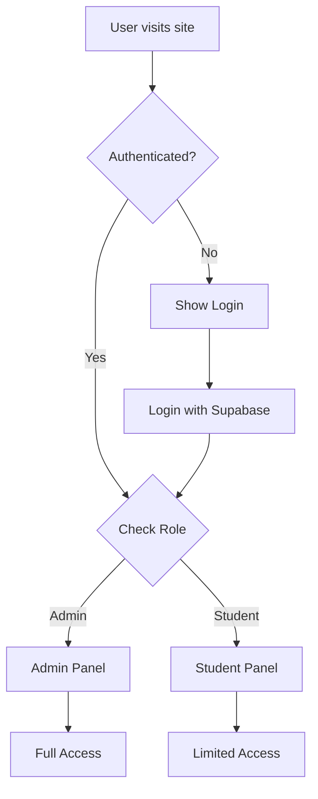

# Smart Classroom Management System - Frontend

React-based web dashboard for the Smart Classroom Management System with Tailwind CSS styling.

## Overview

The frontend provides two main interfaces:
- **Admin Panel**: Full system management (student registration, attendance tracking, room allocation, timetable management)
- **Student Panel**: Personal attendance view and timetable access

## Technology Stack

- **Framework**: React 18
- **Build Tool**: Vite
- **Styling**: Tailwind CSS
- **State Management**: React Context API
- **HTTP Client**: Axios (to be installed)
- **Authentication**: Supabase Auth
- **Routing**: React Router (to be installed)

## Prerequisites

- Node.js (v16 or later)
- npm or yarn
- Backend API running (Supabase)

## Installation

### 1. Install Dependencies

```bash
cd frontend
npm install
```

### 2. Configure Environment Variables

Create a `.env` file in the frontend directory:

```bash
cp .env.example .env
```

Update with your configuration:

```
VITE_SUPABASE_URL=https://your-project.supabase.co
VITE_SUPABASE_ANON_KEY=your_anon_key_here
VITE_API_BASE_URL=http://localhost:3000
```

### 3. Start Development Server

```bash
npm run dev
```

The application will be available at `http://localhost:5173`

## Project Structure

```
frontend/
├── public/                 # Static assets
├── src/
│   ├── components/         # React components
│   │   ├── admin/         # Admin panel components
│   │   │   ├── Navigation.jsx
│   │   │   ├── RegistrationPage.jsx
│   │   │   ├── AttendancePage.jsx
│   │   │   ├── RoomAllocationPage.jsx
│   │   │   └── TimetableManagement.jsx
│   │   ├── student/       # Student panel components
│   │   │   ├── Navigation.jsx
│   │   │   ├── AttendanceView.jsx
│   │   │   ├── TimetableView.jsx
│   │   │   └── CurrentLectureCard.jsx
│   │   ├── shared/        # Shared components
│   │   │   ├── ProgressBar.jsx
│   │   │   ├── LoadingSpinner.jsx
│   │   │   ├── ErrorMessage.jsx
│   │   │   └── Toast.jsx
│   │   ├── auth/          # Authentication components
│   │   │   ├── Login.jsx
│   │   │   ├── ProtectedRoute.jsx
│   │   │   └── AuthContext.jsx
│   │   └── layout/        # Layout components
│   │       ├── AdminLayout.jsx
│   │       └── StudentLayout.jsx
│   ├── utils/             # Utility functions
│   │   ├── api.js         # API client
│   │   └── helpers.js     # Helper functions
│   ├── App.jsx            # Main app component
│   ├── main.jsx           # Entry point
│   └── index.css          # Global styles (Tailwind)
├── .env.example           # Environment variables template
├── .env                   # Environment variables (gitignored)
├── index.html             # HTML template
├── package.json           # Dependencies
├── tailwind.config.js     # Tailwind configuration
├── postcss.config.js      # PostCSS configuration
├── vite.config.js         # Vite configuration
└── README.md              # This file
```

## Features

### Admin Panel

#### Student Registration
- Form with fields: name, email, phone, DOB, course, UID
- "Scan" button to fetch latest RFID scan
- Form validation and error handling
- Success/error notifications

#### Attendance Tracking
- Real-time attendance logs display
- Student attendance percentage calculation
- Visual progress bars (color-coded)
- Filtering by date, course, student
- Auto-refresh every 5 seconds

#### Room Allocation
- Room selection form
- Availability checking
- Alternative room recommendations
- Conflict detection
- Allocation confirmation

#### Timetable Management
- Create timetable entries
- View existing schedules
- Edit and delete functionality
- Course-based filtering

### Student Panel

#### Personal Attendance
- View attendance percentage
- Attendance history table
- Visual progress indicator
- Date range filtering

#### Timetable View
- Weekly schedule grid
- Current day highlighting
- Time, subject, room, professor details
- Responsive layout

#### Current Lecture
- Real-time lecture location
- Room status indicator
- Auto-refresh functionality

## Styling with Tailwind CSS

### Color Scheme

```javascript
// Attendance percentage colors
- Red: < 75% (text-red-600, bg-red-100)
- Yellow: 75-85% (text-yellow-600, bg-yellow-100)
- Green: > 85% (text-green-600, bg-green-100)
```

### Responsive Breakpoints

```javascript
// Tailwind default breakpoints
sm: '640px'   // Mobile landscape
md: '768px'   // Tablet
lg: '1024px'  // Desktop
xl: '1280px'  // Large desktop
```

### Common Utility Classes

```css
/* Layout */
.container { @apply mx-auto px-4 max-w-7xl; }
.card { @apply bg-white rounded-lg shadow-md p-6; }

/* Buttons */
.btn-primary { @apply bg-blue-600 text-white px-4 py-2 rounded hover:bg-blue-700; }
.btn-secondary { @apply bg-gray-200 text-gray-800 px-4 py-2 rounded hover:bg-gray-300; }

/* Forms */
.input { @apply border border-gray-300 rounded px-3 py-2 focus:outline-none focus:ring-2 focus:ring-blue-500; }
.label { @apply block text-sm font-medium text-gray-700 mb-1; }
```

## API Integration

### API Client Setup

```javascript
// src/utils/api.js
import axios from 'axios';

const api = axios.create({
  baseURL: import.meta.env.VITE_API_BASE_URL,
});

// Request interceptor for auth token
api.interceptors.request.use((config) => {
  const token = localStorage.getItem('token');
  if (token) {
    config.headers.Authorization = `Bearer ${token}`;
  }
  return config;
});

// Response interceptor for error handling
api.interceptors.response.use(
  (response) => response,
  (error) => {
    if (error.response?.status === 401) {
      // Redirect to login
      window.location.href = '/login';
    }
    return Promise.reject(error);
  }
);

export default api;
```

### Example API Calls

```javascript
// Fetch attendance logs
const fetchAttendance = async () => {
  const response = await api.get('/api/attendance');
  return response.data;
};

// Register student
const registerStudent = async (studentData) => {
  const response = await api.post('/api/students', studentData);
  return response.data;
};

// Allocate room
const allocateRoom = async (roomData) => {
  const response = await api.post('/api/rooms/allocate', roomData);
  return response.data;
};
```

## Authentication Flow



## Data Structures Integration

The frontend uses custom data structures from the `data-structures` module:

```javascript
import { Queue, Stack, LinkedList, HashMap } from '../../data-structures';

// Queue for RFID scan buffering
const scanQueue = new Queue();

// Stack for navigation history
const navHistory = new Stack();

// LinkedList for attendance records
const attendanceList = new LinkedList();

// HashMap for student lookup
const studentMap = new HashMap();
```

## Building for Production

### Build Command

```bash
npm run build
```

This creates an optimized production build in the `dist/` directory.

### Preview Production Build

```bash
npm run preview
```

### Deployment Options

#### Vercel
```bash
npm install -g vercel
vercel
```

#### Netlify
```bash
npm install -g netlify-cli
netlify deploy --prod
```

#### Supabase Hosting
```bash
supabase deploy
```

## Environment Variables

| Variable | Description | Example |
|----------|-------------|---------|
| `VITE_SUPABASE_URL` | Supabase project URL | `https://xxx.supabase.co` |
| `VITE_SUPABASE_ANON_KEY` | Supabase anonymous key | `eyJhbGc...` |
| `VITE_API_BASE_URL` | Backend API base URL | `http://localhost:3000` |

## Testing

### Run Tests

```bash
npm test
```

### Run Tests with Coverage

```bash
npm run test:coverage
```

## Troubleshooting

### Tailwind Styles Not Applied
- Ensure `index.css` has Tailwind directives
- Check `tailwind.config.js` content paths
- Restart dev server

### API Connection Issues
- Verify backend is running
- Check CORS configuration
- Verify environment variables

### Build Errors
- Clear node_modules and reinstall: `rm -rf node_modules && npm install`
- Clear Vite cache: `rm -rf node_modules/.vite`
- Check for TypeScript errors if using TS

### Authentication Issues
- Verify Supabase credentials
- Check token expiration
- Clear localStorage and re-login

## Performance Optimization

- **Code Splitting**: Use React.lazy() for route-based splitting
- **Memoization**: Use React.memo() for expensive components
- **Virtual Scrolling**: For large lists (attendance logs)
- **Image Optimization**: Use WebP format and lazy loading
- **Bundle Analysis**: Run `npm run build -- --analyze`

## Accessibility

- Semantic HTML elements
- ARIA labels for interactive elements
- Keyboard navigation support
- Color contrast compliance (WCAG AA)
- Screen reader friendly

## Browser Support

- Chrome (latest)
- Firefox (latest)
- Safari (latest)
- Edge (latest)

## Contributing

1. Create feature branch
2. Make changes
3. Test thoroughly
4. Submit pull request

## License

MIT
